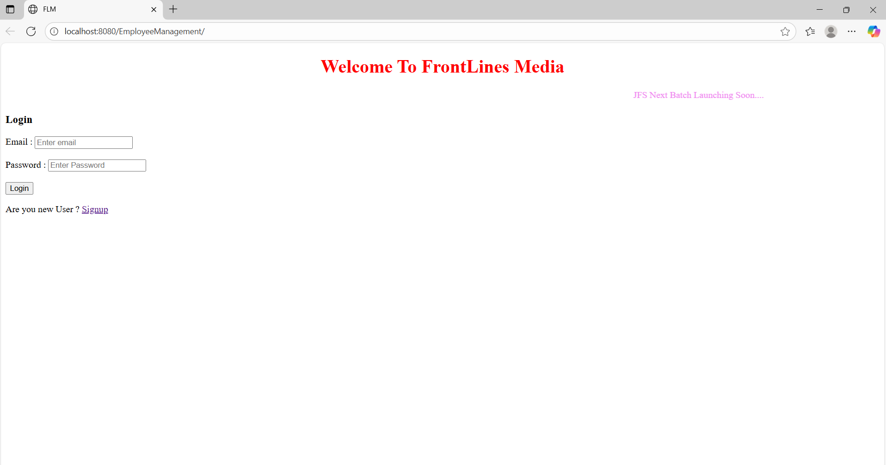
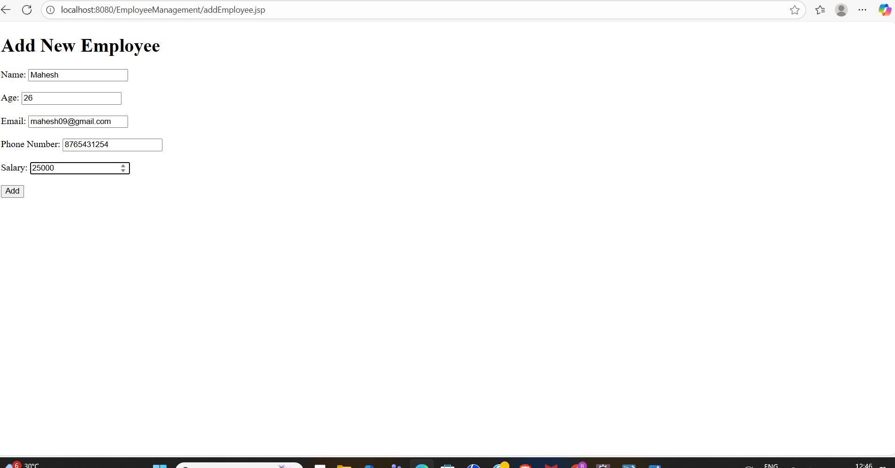
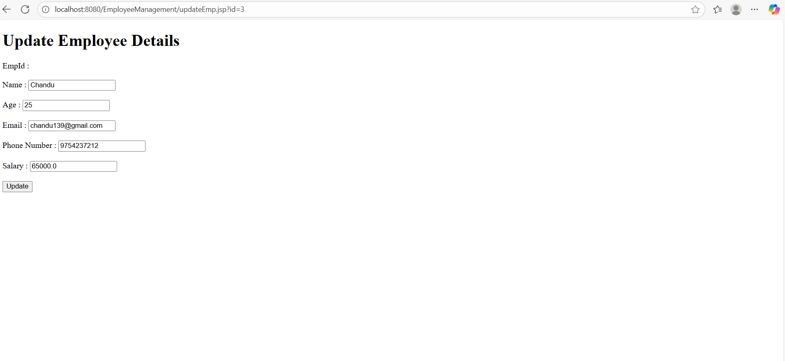
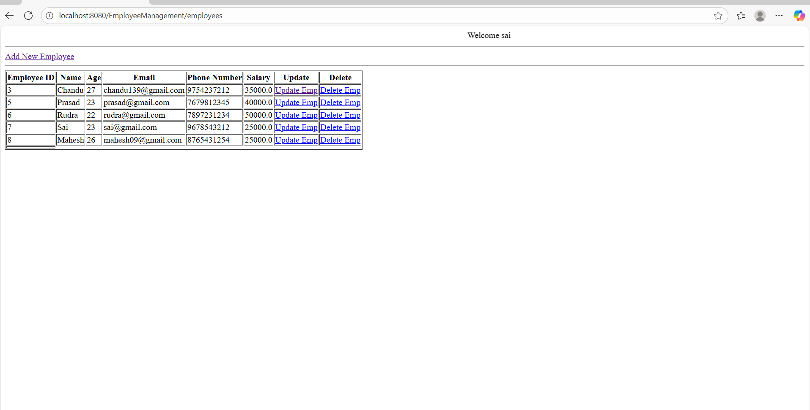

🧑‍💼 Java Full Stack Employee Management System

📖 Overview

The Employee Management System is a web-based full-stack application developed to streamline and automate the management of employee records in an organization.
It allows administrators to add, update, view, and delete employee information, ensuring accurate data handling and reducing manual effort.

This system focuses on providing a secure, efficient, and user-friendly interface, improving workflow and record-keeping efficiency.

🚀 Features

✅ Add, edit, view, and delete employee details
🏢 Manage departments and job roles
🔍 Search and filter employees by ID, name, or department
💾 Secure data storage using MySQL
🧩 Input validation to prevent invalid data entry
🌐 Simple and responsive interface (HTML, CSS, JS)
⚙️ Full integration between frontend, backend, and database

🧰 Tech Stack
Layer	Technology
Frontend	HTML, CSS, JavaScript
Backend	Java (Servlets, JDBC)
Database	MySQL
Server	Apache Tomcat
IDE	Eclipse
Version Control	Git & GitHub
📸 Project Preview
🏠 Home / Dashboard

(Displays overview and navigation menu)

👤 Add Employee Page

(Form to add new employee details with validation)

📋 View Employee Details

(Displays employee data with edit and delete options)

👨‍💻 My Role

Designed and implemented backend logic using Java Servlets and JDBC

Developed UI using HTML, CSS, and JavaScript

Integrated CRUD operations between frontend and MySQL

Managed database design and exception handling

Performed end-to-end testing for functionality and reliability

🎯 Outcomes & Learnings

Gained practical experience in Java Full Stack Development

Improved understanding of JDBC connectivity and servlet request-response cycle

Strengthened UI/UX design and debugging skills

Learned to manage version control using Git and GitHub

Understood the deployment process using Apache Tomcat

⚡ How to Run

Clone this repository
git clone https://github.com/SanjayMaddhali29999/Java-Full-Stack-Employee-Management-System-Java-JSP-Servlets-JDBC-HTML-CSS-MySQL-.git
Open the project in Eclipse IDE
Configure Apache Tomcat Server
Import the MySQL database and update connection credentials
Run the project and open:
http://localhost:8080/EmployeeManagementSystem
📬 Contact

👤 Maddhali Rudra Sai Naga Venkata Sanjay Gupta
📍 Vijayawada, Andhra Pradesh, India
📧 rudramaddhali212@gmail.com
🔗 LinkedIn: https://www.linkedin.com/in/sanjay-maddhali9999/

📸 Project Screenshots
### 📸 Project Screenshots

#### 🏠 Home / Index Page  
(Displays overview and navigation menu)  

#### 🧭 Dashboard Page  
(Shows employee records and CRUD options)  

👤 Add Employee  
(Form to add a new employee’s details)  

✅ Employee Added Successfully  
(Confirmation message after adding employee)  

✏️ Update Employee Page  
(Form to update existing employee details)  

🔄 Updated Employee Confirmation  
(Confirmation message after updating employee data)  

🗑️ Deleted Employee Confirmation  
(Confirmation message after deleting an employee record)  

👤 Signup Page  
(Register new user for the system)  

🔐 Login Page  
(User authentication before accessing the system)  

